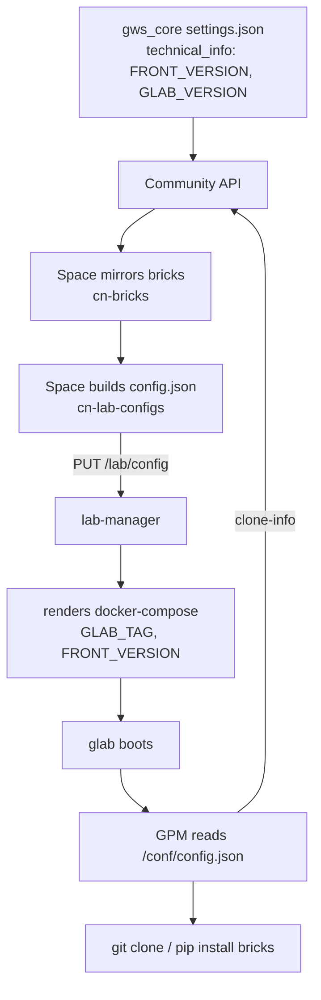

# Constellab platform map

_Last verified: 2026-08-28._

How the Constellab repositories fit together. This file holds only what a single repository
cannot tell you — the chains, constraints and deliberate oddities that span several. Anything one
grep answers (route lists, module names, scripts) is left to the code, which cannot go stale.

Read this before work that touches more than one repository, before cutting a release, and before
"fixing" something in [Deliberate oddities](#deliberate-oddities).

Paths below are written `<repo>/<path>`, assuming every repository sits as a sibling in one folder.

## Two planes

Constellab splits into a **control plane** in the cloud and a **compute plane** per lab.

The control plane (Space + Community) owns identity, organisation and governance. The compute
plane (one data lab, cloud or on-premise) runs the science. The Space is the control plane for
every lab: it provisions the server, configures it, starts and stops it, and backs it up. A lab
holds no credentials of its own.

## The repositories

| Repository | Plane | What it is | Publishes | Tag |
| --- | --- | --- | --- | --- |
| `monorepo-back` | cloud | NestJS: `cn-space-api` (Space) and `hn-community-api` (Community) | `constellab/space-api`, `constellab/community-api` → CapRover | `cn_*`, `hn_*` |
| `monorepo-front` | both | Angular/Nx: `ca-space-front`, `ha-community-front`, `lab-front`, `lab-manager-standalone`, `dc-dashboard-components` | matching images | `ca_*`, `ha_*`, `lab_*`, `lms_*`, `dc_*` |
| `lab-manager` | lab | NestJS agent on the lab server; holds `docker.sock` and orchestrates the lab's containers | `constellab/lab-manager` | tag |
| `gpm` | lab | Builds the lab images; installs bricks at container boot | `constellab/glab`, `codelab`, `lab-dev-env` (cpu + gpu) | tag |
| `lab-configurer` | lab | Server bootstrap scripts, plus the `lab_manager` + traefik compose | — | — |
| `gws_core` | lab | The Python brick that **is** the data lab (FastAPI + Peewee) | published to Community | `gws brick version push` |

Three more repositories participate without being checked out alongside the others:

- **`Constellab/dashboard-components`** — a release sink, not a source tree. The `dc_*` tag in
  `monorepo-front` builds three bundles and pushes them as GitHub releases *into that repository*,
  where `gws_core` downloads them at runtime.
  Source: `monorepo-front/.github/workflows/build_dashboard_components.yml`,
  `gws_core/src/gws_core/apps/app_plugin_downloader.py`
- **`Constellab/agent-plugins`** — the public Claude Code plugin marketplace, published from
  `monorepo-back` on `cn_*` / `hn_*`.
  Source: `monorepo-back/.github/workflows/publish_agent_plugin.yml`
- **Other bricks** (`gws_biota`, `gws_academy`, …) — published on the Community, installed per lab.

### gws_core is not a sibling folder

`gws_core` lives inside the dev-env container's `/lab` volume, host-mounted at
`dev-env-volumes/dev-env/app/user/bricks/gws_core`. Treat it as a full repository; it will not
appear in a listing of the workspace root.

## The version chain

A lab's image tags are derived from the gws_core release, not chosen independently.



Source: `gws_core/settings.json`,
`monorepo-back/apps/cn-space-api/src/app/cn-lab-configs/cn-lab-configs.service.ts`,
`lab-manager/src/assets/docker-compose.yml`, `gpm/init/script/gencovery_package_manager.py`

## Release ordering

**`lab-manager` releases independently.** Tag, release, then move labs forward one at a time.

**`lab-front`, `glab` and `gws_core` are ordered, and the order is not optional:**

1. Push `lab_*` in `monorepo-front` → `constellab/lab-front:<X>` is on Docker Hub.
2. Push the `gpm` tag → `constellab/glab:<Y>` and codelab are on Docker Hub.
3. *Then* publish the gws_core version declaring `FRONT_VERSION = <X>` and `GLAB_VERSION = <Y>`.

Publishing gws_core first makes the Space generate a `config.json` naming image tags that do not
exist. The pull fails and the lab breaks. gws_core is always tagged last, and never introduces a
version number.

## Lab runtime topology

traefik terminates TLS on `*.${VIRTUAL_HOST}` and fronts:

| Host | Container | Purpose |
| --- | --- | --- |
| `lab-manager.` | lab-manager | Control API, `api-key` auth |
| `lab.` | front | `constellab/lab-front` |
| `glab.` | glab :3000 | gws_core prod server |
| `app-*.` | glab :8510 | Streamlit / Reflex applications |
| `codelab.` | codelab :8080 | openvscode-server, basic auth |
| `glab-dev.` | codelab :3000 | gws_core dev server |
| `appdev-*.` | codelab :8510 | dev applications |

A mariadb per environment; `gencovery-network-prod` and `-dev` stay separate.

glab exposes three API surfaces on one port: `/core-api` (lab-front, lab users, the app gateway),
`/space-api` (inbound from the Space and lab-manager) and `/s3-server/v1` (S3-compatible).

Source: `lab-manager/src/assets/docker-compose.yml`, `gws_core/src/gws_core/core/utils/settings.py`

## Cross-plane calls

Direction and auth matter more than the route lists, which the controllers hold.

| From | To | Surface | Auth |
| --- | --- | --- | --- |
| Space | lab-manager | `/lab`, `/docker-compose`, `/docker-containers`, `/backup`, `/adminer` | `api-key` |
| Space | glab | `/space-api` | `api-key` |
| glab | Space | `/external-labs` | `api-key` |
| lab-manager | Space | `/external-labs-manager` | `api-key` |
| glab, lab-manager | Community | `/lab/brick` | `api-key`, private bricks only |
| Community | Space | `/external-community`, `/external-community-labs` | service |
| lab | lab | `/space-api` on the peer | `api-key` |

Two of these are load-bearing and unobvious:

- **The Space provisions and configures the server over SSH.** It clones `lab-configurer` at a
  configured branch and runs `prepare_server.sh`, `utils/init.sh`, `docker compose up/down`,
  `update_lab_manager.sh`. `lab-configurer` is executable infrastructure, not a manual runbook.
  Source: `monorepo-back/apps/cn-space-api/src/app/cn-labs/server/cn-lab-configurer.service.ts`
- **The Space is traefik's ACME DNS-01 endpoint.** Certificates resolve through
  `/external-labs-manager/lab/dns/{present,cleanup}` on the Space API.
  Source: `lab-configurer/docker-compose.yml`

## Brick resolution in a lab

Inside the lab (`LAB_FOLDER=/lab`):

```
/lab/.sys/bricks/<name>      managed — GPM clones from Community per /conf/config.json, and prunes
/lab/.sys/app/settings.json  aggregated settings for `gws server run --settings-path`
/lab/user/bricks/<name>      yours — git clone a brick here to work on it
/lab/user/{data,notebooks}
```

**User bricks shadow managed ones, at both layers.** GPM skips installing a brick that already
exists under `user/bricks`. At runtime gws_core prefers the user path, and in dev mode
(`LAB_MODE != prod`) additionally loads *every* brick found in `user/bricks` even when the config
does not declare it, then imports them so the `@task_decorator` / `@resource_decorator`
registrations fire.

So the same brick at two versions in `.sys/` and `user/` is the normal working state, and the
`user/` copy is the one that runs.

Source: `gpm/init/script/brick_installer.py`, `gws_core/src/gws_core/settings_loader.py`

## Deployment shapes

| Shape | Reachable from the cloud | Configured by |
| --- | --- | --- |
| `prod` | yes | the Space |
| `private-cloud` | no | standalone front on `lab-config.${VIRTUAL_HOST}` |
| `on-premise` | sometimes | the Space, or `curl` against lab-manager directly |
| `desktop` | no | one `docker run` string the Space generates; standalone front on host port 82 |

Source: `lab-manager/src/app/core/models/config.class.ts`

## Deliberate oddities

Each of these reads as a bug and is not. Confirm here before changing any of them.

- **`core-lib` exists in both monorepos with the same `Cl` prefix, and they have diverged.**
  Originally one shared library, now two unrelated ones. The drift is not a defect, and the two
  are not to be reconciled.
- **The local dev stack starts a `community_db`, yet the dev-env container points at the
  production Community.** Deliberate: it lets a lab start locally without running the Community,
  and local work targets bricks rather than the Community itself.
  Source: `lab-configurer/local/docker-compose.yml`
- **glab has no `docker.sock`.** A brick that needs its own containers registers a sub-compose
  with lab-manager over the API, keyed by `(brickName, uniqueName)`. `StartDockerComposeTask` lets
  a scenario do it as a pipeline step.
  Source: `gws_core/src/gws_core/docker/docker_service.py`, `lab-manager/src/app/docker/compose/`
- **"Datahub" is not a flag on a lab.** It is a `bucket` row of type `LAB` pointing at a lab,
  which a root folder uses as its storage backend. Backends are interchangeable: `NORMAL` (S3),
  `LAB` (that lab's `/s3-server/v1`), `AZURE`, `GCP`.
  Source: `monorepo-back/apps/cn-space-api/src/app/cn-object-storages/`
- **The lab stores no passwords.** Login goes lab-front → glab → Space `/external-labs/check-credentials`,
  and glab registers itself with `PUT /external-labs/start` on boot to pull its user list.

## Related documents

Per-repository domain docs stay per-repository; this file does not replace them.

- `monorepo-front/docs/concepts/` — the product object model, shared across the three environments.
- `monorepo-back/CONTEXT.md` — identity and machine-access vocabulary.
- `monorepo-back/docs/adr/` — decisions behind the Space API.
