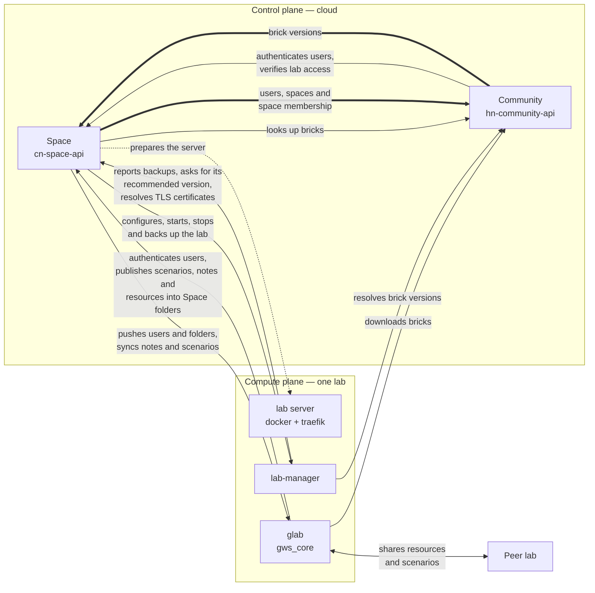

# Constellab platform map

_Last verified: 2026-09-17._

How the Constellab repositories fit together. This file holds only what a single repository
cannot tell you — the chains, constraints and deliberate oddities that span several. Anything one
grep answers (route lists, module names, scripts) is left to the code, which cannot go stale.

Read this before work that touches more than one repository, before cutting a release, and before
"fixing" something in [Deliberate oddities](#deliberate-oddities).

Paths below are written `<repo>/<path>`, assuming every repository sits as a sibling in one folder.

## Two planes

Constellab splits into a **control plane** in the cloud and a **compute plane** per lab.

The control plane (Space + Community) owns identity, organisation and governance. The compute
plane (one data lab, cloud or on-premise) runs the science. The Space is the control plane for
every lab: it provisions the server, configures it, starts and stops it, and backs it up. A lab
has no identity of its own — its users are the Space's users, and every login resolves there.

## The repositories

| Repository       | Plane | Publishes                                                                                                                                                                   | Tag                                      |
| ---------------- | ----- | --------------------------------------------------------------------------------------------------------------------------------------------------------------------------- | ---------------------------------------- |
| `monorepo-back`  | cloud | `ghcr.io/constellab/space-api`, `ghcr.io/constellab/community-api` (deployed to CapRover as a separate manual step — see [Cloud hosting](#cloud-hosting-pre-prod-and-prod)) | `cn_*`, `hn_*`                           |
| `monorepo-front` | both  | `ghcr.io/constellab/space-front`, `ghcr.io/constellab/community-front`, `constellab/lab-front`, `constellab/lab-manager-standalone`, and dashboard-components _releases_    | `ca_*`, `ha_*`, `lab_*`, `lms_*`, `dc_*` |
| `lab-manager`    | lab   | `constellab/lab-manager`                                                                                                                                                    | any tag                                  |
| `gpm`            | lab   | `constellab/glab` (+ `gpu-` variants), `constellab/codelab`, `constellab/lab-dev-env`                                                                                       | any tag                                  |
| `lab-configurer` | lab   | `constellab/lab-manager-dev-env` (local dev stack only)                                                                                                                     | `lm-*`                                   |
| `gws_core`       | lab   | the brick itself, published to the Community                                                                                                                                | `gws brick version push`                 |

Two registries: the cloud APIs and the two cloud fronts go to GHCR, the images a lab pulls go to
Docker Hub.

**`monorepo-back`** — the cloud back end. `cn-space-api` is the Space: identity, organisation,
folders and storage, plus the control API for every lab — it provisions the server, generates each
lab's config, and holds the credentials the lab does not. `hn-community-api` is the Community: the
brick registry and documentation site that labs pull from.
_Talks to:_ drives lab-manager and glab; receives calls from glab and lab-manager; exchanges with
the Community in both directions — HTTP for brick lookups, Redis queues for users, spaces and
brick versions.

**`monorepo-front`** — every user interface, in one Nx workspace. `ca-space-front` and
`ha-community-front` are the two cloud UIs; `lab-front` is served from inside each lab;
`lab-manager-standalone` configures a lab the Space cannot reach; `dc-dashboard-components` ships
the widgets gws_core renders in a lab's dashboards.
_Talks to:_ only the API of the plane that serves it. No front makes a cross-plane call of its own.

**`lab-manager`** — the control agent on the lab server, and the only component holding
`docker.sock`. Everything that starts, stops, backs up or reconfigures the lab's containers goes
through it; the Space never speaks to Docker directly. It releases independently of the rest.
_Talks to:_ takes orders from the Space; calls back the Space (`/external-labs-manager`, ACME
DNS-01 included) and the Community (`/lab/brick`).

**`gpm`** — builds the images a lab runs on, then at container boot turns the lab's `config.json`
into an installed brick set. It is the seam between what a lab _declares_ and what is actually
importable in the container.
_Talks to:_ reads `/conf/config.json` (written by the Space, delivered by lab-manager) and clones
bricks from the Community.

**`lab-configurer`** — the server bootstrap: what the Space clones and runs over SSH to turn a bare
machine into a lab server (`prepare_server.sh`, the lab-manager + traefik compose,
`update_lab_manager.sh`), plus the local dev environment — the only way to develop a brick
(see below). Executable infrastructure, not a runbook.
_Talks to:_ nothing at runtime — it is run _on_ the server, _by_ the Space.

**`gws_core`** — the Python brick that **is** the data lab: tasks, resources, scenarios, the
dashboard apps and the S3 surface. Every other brick builds on it, and its release drives the
version chain below.
_Talks to:_ the Space (`/external-labs`), the Community (`/lab/brick`), and peer labs.

Three more repositories participate without being checked out alongside the others:

- **`Constellab/dashboard-components`** — a release sink, not a source tree. The `dc_*` tag in
  `monorepo-front` builds three bundles and pushes them as GitHub releases _into that repository_,
  where `gws_core` downloads them at runtime.
  Source: `monorepo-front/.github/workflows/build_dashboard_components.yml`,
  `gws_core/src/gws_core/apps/app_plugin_downloader.py`
- **`Constellab/agent-plugins`** — the public Claude Code plugin marketplace, published from
  `monorepo-back` on `cn_*` / `hn_*`.
  Source: `monorepo-back/.github/workflows/publish_agent_plugin.yml`
- **Other bricks** (`gws_biota`, `gws_academy`, …) — published on the Community, installed per lab.

### Developing in a lab means running a lab

A brick only runs inside a lab, so `gws_core` cannot be worked on standalone. Local brick
development starts by creating a lab environment from `lab-configurer/local` (`init.sh`, then
`docker compose --env-file ./.env up -d`), which runs the `constellab/lab-dev-env` image built by
`gpm`. The steps are in `lab-configurer/README.md`, section _Lab dev environment_.

That is also why `gws_core` is not a sibling folder: it lives inside the dev-env container's `/lab`
volume, host-mounted at `dev-env-volumes/dev-env/app/user/bricks/gws_core`. Treat it as a full
repository; it will not appear in a listing of the workspace root.

## The version chain

A lab's image tags are not chosen; they are read out of the gws_core release.
`gws_core/settings.json` declares them under `technical_info` — today `FRONT_VERSION: 2.10.3`,
`GLAB_VERSION: 2.18.0` — and they are published to the Community along with the brick.

| Declared in gws_core        | Pins                                                                                             |
| --------------------------- | ------------------------------------------------------------------------------------------------ |
| `GLAB_VERSION` → `GLAB_TAG` | `constellab/glab:${TAG_PREFIX}${GLAB_TAG}` **and** `constellab/codelab:${TAG_PREFIX}${GLAB_TAG}` |
| `FRONT_VERSION`             | `constellab/lab-front:${FRONT_VERSION}`, plus an env var passed into glab and codelab            |

`TAG_PREFIX` is `gpu-` on a GPU lab, empty otherwise. Both numbers reach lab-manager as
`config.json` fields (`glab_tag`, `front_version`), which it turns into env vars for the compose
template.

**Two components resolve this independently.** The Space reads the brick it mirrored from the
Community — over `brick_queue`, see [Cross-plane calls](#cross-plane-calls) — and writes
`config.json` (`cn-lab-configs`). But lab-manager, when it is configured
directly — on-premise, standalone, `curl` — asks the Community for the gws_core version itself and
derives the same two fields (`updateBrickConfig`). One rule, two code paths: change one and the
other keeps the old behaviour.

Source: `gws_core/settings.json`,
`monorepo-back/apps/cn-space-api/src/app/cn-lab-configs/cn-lab-configs.service.ts`,
`lab-manager/src/app/lab/lab.service.ts`,
`lab-manager/src/app/lab/env-variable/env-variable.service.ts`,
`lab-manager/src/assets/docker-compose.yml`

## Release ordering

**`lab-manager` releases independently.** Tag, release, then move labs forward one at a time.

**`lab-front`, `glab` and `gws_core` are ordered, and the order is not optional:**

1. Push `lab_*` in `monorepo-front` → `constellab/lab-front:<X>` is on Docker Hub.
2. Push the `gpm` tag → `constellab/glab:<Y>` (cpu + gpu), `codelab` and `lab-dev-env` are on
   Docker Hub.
3. _Then_ publish the gws_core version declaring `FRONT_VERSION = <X>` and `GLAB_VERSION = <Y>`.

Publishing gws_core first makes the Space generate a `config.json` naming image tags that do not
exist. The pull fails and the lab breaks. gws_core is always tagged last, and never introduces a
version number.

## Cloud hosting: pre-prod and prod

The cloud plane runs on **two CapRover instances hosted at OVH, one per environment, on two
separate machines**. They share nothing — not the host, not the database, not the certificates.

| Environment | CapRover dashboard                                  | CapRover root domain                |
| ----------- | --------------------------------------------------- | ----------------------------------- |
| pre-prod    | `https://captain.constellab-pre-prod.gencovery.com` | `constellab-pre-prod.gencovery.com` |
| prod        | `https://captain.constellab.gencovery.com`          | `constellab.gencovery.com`          |

Four apps run on each instance — the two APIs and the two cloud fronts. The app names are what the
deploy scripts pass to CapRover:

| App             | Repository       | Tag    | pre-prod app               | prod app          |
| --------------- | ---------------- | ------ | -------------------------- | ----------------- |
| Space API       | `monorepo-back`  | `cn_*` | `space-api-pre-prod`       | `space-api`       |
| Community API   | `monorepo-back`  | `hn_*` | `community-api-pre-prod`   | `community-api`   |
| Space front     | `monorepo-front` | `ca_*` | `space-front-pre-prod`     | `space-front`     |
| Community front | `monorepo-front` | `ha_*` | `community-front-pre-prod` | `community-front` |

### Certificates

Two layers, and only one of them is CapRover's.

- **The root domain** — `constellab-pre-prod.gencovery.com` and `constellab.gencovery.com`. Every
  app gets `<app>.<root>` with a CapRover-issued certificate (HTTP-01, "Enable HTTPS"), renewed by
  CapRover on its own. Nothing to do.
- **The nice public domains** — `preconstellab.com` in pre-prod, `constellab.space` in prod. These
  are extra domains attached by hand to individual apps, each with its own certificate. They are
  what users actually type.

The front is the exception that shapes the whole setup: **a workspace can live on any subdomain of
`*.constellab.space`**, so its certificate has to be a wildcard, and CapRover's HTTP-01 challenge
cannot validate a wildcard. So for the front the nginx config was modified by hand and the
certificates are issued outside CapRover, with the DNS-01 challenge against the OVH API
(`certbot/dns-ovh`). This used to be a manual run every three months; **it is now renewed
automatically** by a script under root's cron, twice a day.

Everything about the manual certificates — issuing, the OVH token rights, the renewal script, the
cron entry, and the debugging path — is in **`lab-configurer/caprover`**
(`CAPROVER_CERTIFICATES.md`, `renew-certs.sh`). Read it before touching a certificate.

There is also a written incident note on the platform itself:
<https://ec7de50a-19f0-4188-9fb6-615ae8e6f083.constellab.space/app/folder/document/beb9d357-10fe-4a1e-9325-41100df00874>

### Deploying

Two steps, and they are deliberately separate — tagging publishes an image, it does not ship it.
**The two fronts deploy exactly the same way**, with their own copy of the same `deploy.mjs` in
`monorepo-front`; only the tag prefix and the app name change.

1. **Push a tag** on the app's prefix. GitHub Actions runs the test suites against the tagged
   commit first, and only a green run builds and pushes the image to GHCR. A red suite means no
   image, which is the point: an image in the registry is one somebody can deploy.
2. **Run the deploy script**, from the repository that owns the app, once per environment:

   ```bash
   # monorepo-back
   bun run cn-space-api:caprover-deploy-preprod        # Space API       → pre-prod
   bun run cn-space-api:caprover-deploy-prod           # Space API       → prod
   bun run hn-community-api:caprover-deploy-pre-prod   # Community API   → pre-prod
   bun run hn-community-api:caprover-deploy-prod       # Community API   → prod

   # monorepo-front
   bun run ca-space-front:caprover-deploy-preprod      # Space front     → pre-prod
   bun run ca-space-front:caprover-deploy-prod         # Space front     → prod
   bun run ha-community-front:caprover-deploy-pre-prod # Community front → pre-prod
   bun run ha-community-front:caprover-deploy-prod     # Community front → prod
   ```

   (The two Space scripts spell it `preprod`, the two Community ones `pre-prod` — in both
   repositories. Inconsistent, and all four are the real names.)

**Nothing is uploaded from your machine.** The command only tells CapRover which image tag to run;
CapRover pulls it from GHCR itself, with credentials it already holds. So the image must exist in
the registry before you deploy, and your local git tags only matter for guessing the version
number — check what the script prints before you confirm a prod deploy.

Source: `monorepo-back/package.json`, `monorepo-back/deploy.mjs`,
`monorepo-back/.github/workflows/build-space-api.yml`, `monorepo-front/package.json`,
`lab-configurer/caprover/CAPROVER_CERTIFICATES.md`

## Data stores

| Store              | Owner                         | Holds                                                                   |
| ------------------ | ----------------------------- | ----------------------------------------------------------------------- |
| Space DB           | cn-space-api                  | users, spaces, folders, labs, buckets — the only place a password lives |
| Community DB       | hn-community-api              | bricks, documentation, and its own copy of users and spaces             |
| Redis              | **shared by both cloud APIs** | the BullMQ queues that keep those two copies in sync                    |
| `gws_core_prod_db` | one lab                       | prod data, volume `/app/gws_db/gws_core/prod/mariadb`                   |
| `gws_core_dev_db`  | one lab                       | dev data, its own volume and network                                    |
| `test_gws_dev_db`  | one lab                       | tmpfs, RAM-backed, gone on restart                                      |

Nothing is shared across the two planes: no lab ever connects to a cloud database, and the Space
reads lab data only through glab's API. The one genuinely shared store is the cloud Redis, which
is why the Space and the Community are not independently deployable.

Source: `lab-manager/src/assets/docker-compose.yml`,
`monorepo-back/libs/back-core-lib/src/lib/modules/bl-transport/bl-transport-config.class.ts`

### Backups

Each plane backs itself up to S3, and the two mechanisms have nothing in common.

**The cloud APIs back up their own database.** A cron in each app, daily at 00:00, reads every
table and writes the whole database as one JSON file to an OVH S3 bucket
(`OBJECT_STORAGE_DB_BACKUP_*`, set per environment in CapRover): `cn-space.json` for the Space,
`hn-community.json` for the Community. Two things follow from that shape — the filename is fixed,
so each run replaces the previous object and any history comes from bucket versioning, not from
the app; and the dump is rows, not a `mysqldump`, so it carries no schema and restoring means
replaying it into a database the migrations already built.

**A lab is backed up by lab-manager, and the Space decides when and where.** The Space hands over
the target buckets, the frequency and the S3 prefix; lab-manager runs the backup and reports the
history back. It uploads two streams under that prefix — a MariaDB dump of the **prod** database
(`db/dump.sql`) and an rclone sync of the lab's data (`data/`, plus a file-ownership manifest used
on restore). The dev and test databases are never backed up.

Source: `monorepo-back/libs/back-core-lib/src/lib/modules/bl-db-backup/bl-db-backup.service.ts`,
`monorepo-back/apps/cn-space-api/src/app/cn-core/cron/cn-db-backup.cron.ts`,
`lab-manager/src/app/backup/backup.service.ts`

## Cross-plane calls

Who calls whom, and what for. Direction matters more than the route lists, which the
controllers hold.



Solid edges are HTTP, the dashed edge is SSH, and the thick edges are Redis/BullMQ queues — the
Space and the Community synchronise through a shared Redis, not through their APIs. The table below
says the same thing per surface, with the auth scheme.

| From              | To          | Surface                                                                | What for                                                                                                        | Auth                            |
| ----------------- | ----------- | ---------------------------------------------------------------------- | --------------------------------------------------------------------------------------------------------------- | ------------------------------- |
| Space             | lab-manager | `/lab`, `/docker-compose`, `/docker-containers`, `/backup`, `/adminer` | write the lab's config, start/stop its containers, trigger and restore backups                                  | `api-key`                       |
| Space             | glab        | `/space-api`                                                           | push users, folders and settings; sync notes and scenarios                                                      | `api-key`                       |
| glab              | Space       | `/external-labs`                                                       | register on boot and pull the user list, verify a password, publish scenarios, notes and resources into folders | `api-key`                       |
| lab-manager       | Space       | `/external-labs-manager`                                               | get its backup targets and report backup history, ask its recommended version, resolve ACME DNS-01 challenges   | `api-key`                       |
| glab, lab-manager | Community   | `/lab/brick`                                                           | resolve a brick version and get the URL to clone it                                                             | `api-key`, private bricks only  |
| Community         | Space       | `/external-community`, `/external-community-labs`                      | check a user still exists, verify a lab's api-key and rights, check a lab's access to a private brick           | service                         |
| Community         | Space       | `/auth/external/check-credentials`, `/auth/external/check-2fa`         | verify a password and its 2FA at login — the Community checks neither itself                                    | public, throttled               |
| Space             | Community   | `/space/brick`                                                         | look up a brick and the version info a lab config needs                                                         | service                         |
| Space             | Community   | queues `user_queue`, `space_user_queue`                                | mirror users, spaces and space membership into the Community                                                    | shared Redis                    |
| Community         | Space       | queue `brick_queue`                                                    | keep the Space's brick mirror current                                                                           | shared Redis                    |
| lab               | lab         | `/external-lab-api` on the peer                                        | share resources and scenarios with a peer lab                                                                   | its own `api-key` + `X-User-Id` |

Every HTTP edge uses the `api-key` scheme except the two Space ↔ Community ones, which use service
auth. The lab-to-lab key is not the platform's key — see below.

Four of these are load-bearing and unobvious:

- **The Space provisions and configures the server over SSH.** It clones `lab-configurer` at a
  configured branch and runs `prepare_server.sh`, `utils/init.sh`, `docker compose up/down`,
  `update_lab_manager.sh`. `lab-configurer` is executable infrastructure, not a manual runbook.
  Source: `monorepo-back/apps/cn-space-api/src/app/cn-labs/server/cn-lab-configurer.service.ts`
- **The Space is traefik's ACME DNS-01 endpoint.** Certificates resolve through
  `/external-labs-manager/lab/dns/{present,cleanup}` on the Space API.
  Source: `lab-configurer/docker-compose.yml`
- **Lab-to-lab sharing uses its own key, on its own surface.** Two labs exchange resources and
  scenarios over `/external-lab-api`, not `/space-api`. The key is generated by hand and registered
  in both labs as a `lab` credential; it is unrelated to the key the Space uses, and the call
  carries an `X-User-Id` header so the peer can resolve the acting user.
  Source: `gws_core/src/gws_core/external_lab/external_lab_auth.py`,
  `gws_core/src/gws_core/credentials/credentials_type.py`
- **The Space and the Community synchronise over a shared Redis, not over HTTP.** The Space
  produces on `user_queue` (`createOrUpdateUser`, `deleteUser`) and `space_user_queue`
  (`createSpaceUser`, `updateSpaceUser`, `removeSpaceUser`, `deleteSpace`); the Community produces
  on `brick_queue`, which is how the Space's brick mirror stays current. Neither app can be moved
  or restarted in isolation from that Redis, and none of this traffic appears in any controller.
  Source: `monorepo-back/libs/back-core-lib/src/lib/modules/bl-transport/bl-transport-config.class.ts`,
  `apps/hn-community-api/src/app/space-aggregate/hn-space.processor.ts`,
  `apps/cn-space-api/src/app/cn-bricks/cn-bricks.processor.ts`

## Logging in

Three environments have a login — the Space, the Community and a lab. Nothing else does:
lab-manager, GPM and lab-configurer authenticate machine to machine with an api-key, and codelab
uses basic auth.

**Only the Space verifies a password.** The other two ask it.

| Environment | Credentials go to                   | Password checked by                           | Session issued by               |
| ----------- | ----------------------------------- | --------------------------------------------- | ------------------------------- |
| Space       | `POST /auth/login` on the Space     | the Space                                     | the Space — JWT + refresh token |
| Community   | `POST /auth/login` on the Community | the Space, `/auth/external/check-credentials` | the Community — its own JWT     |
| Lab         | login on glab                       | the Space, `/external-labs/check-credentials` | glab — its own session          |

2FA is delegated the same way: the Space answers `2FA_REQUIRED` with a `twoFAUrlCode`, the
Community or the lab hands it back to its own front, and the second step resolves against the Space
again (`/auth/external/check-2fa`).

Two consequences worth knowing before debugging a login:

- **A user can log into a lab only if the Space gives them access to that lab** — but no check at
  login time enforces it. `check-credentials` verifies the password, the account status and 2FA,
  and says nothing about lab membership. The rule holds because the Space owns the lab's user
  table: glab pulls it with `PUT /external-labs/start` on boot, the Space pushes every change
  (`addUser`, `deactivateUser`), and glab resolves the email against that local table _before_
  calling the Space. So revoking access in the Space fails the login at the lab, not at the Space —
  and a lab that has not synced recently can still let a revoked user in.
- **A local dev lab skips the Space entirely.** `is_local_dev_env()` returns a session as soon as
  the user exists locally, without checking any password. Convenient, and not the production path —
  never conclude from a local login that the chain works.

A cloud lab on the standard Constellab domain also carries a captcha through this chain — it is
the only domain registered with Google, so `check-credentials` validates one and
`check-credentials-simple` does not.

The Space also verifies a password outside login: the lab calls `check-credentials-simple`
(`for_login=False`) to re-confirm the current user before revealing a stored credential.

Source: `monorepo-back/apps/cn-space-api/src/app/cn-auth/cn-auth.controller.ts`,
`monorepo-back/apps/hn-community-api/src/app/auth/hn-space-auth.service.ts`,
`gws_core/src/gws_core/user/authentication_service.py`,
`gws_core/src/gws_core/credentials/credentials_service.py`,
`monorepo-back/apps/cn-space-api/src/app/cn-labs/cn-lab-aggregate.service.ts`

## Brick resolution in a lab

At container boot GPM reads `/conf/config.json` — the file lab-manager rendered — and reconciles
the lab's bricks against it. Inside the lab (`LAB_FOLDER=/lab`):

```
/lab/.sys/bricks/<name>      managed — GPM clones from Community per /conf/config.json, and prunes
/lab/.sys/app/settings.json  aggregated settings for `gws server run --settings-path`
/lab/user/bricks/<name>      yours — git clone a brick here to work on it
/lab/user/{data,notebooks}
```

**User bricks shadow managed ones, at both layers.** GPM skips installing a brick that already
exists under `user/bricks`. At runtime gws_core prefers the user path, and in dev mode
(`LAB_MODE != prod`) additionally loads _every_ brick found in `user/bricks` even when the config
does not declare it, then imports them so the `@task_decorator` / `@resource_decorator`
registrations fire.

So the same brick at two versions in `.sys/` and `user/` is the normal working state, and the
`user/` copy is the one that runs.

Source: `gpm/init/script/gencovery_package_manager.py`, `gpm/init/script/brick_installer.py`,
`gws_core/src/gws_core/settings_loader.py`

### A private brick clones with a credential stored in the Community

A public brick is cloned from its git URL as is. A **private** one cannot be, so the Community
holds a git username and a Personal Access Token per brick (`credentialUsername`,
`credentialPassword`) and never hands out the plain URL: `repositoryAccessUrl` injects them into
the URL (`https://<user>:<token>@…`), and that is the string gpm passes to `git clone`. The lab
never knows a credential exists; it receives a URL that happens to work.

Two consequences:

- **The token travels to every lab that installs the brick**, inside the clone URL. It is only as
  confidential as the labs allowed to install that brick. The Community does gate the call — a
  private brick's clone info requires the Space to confirm the lab has access — but once the URL is
  out, the token is out.
- **When a private brick stops installing, suspect the token before the code.** An expired or
  revoked token fails at `git clone`, which reads as "brick not found" far more often than as an
  authentication problem.

**Today every one of these tokens belongs to a single personal GitHub account (`bmaisonneuve`).**
They still work. But they are personal, not organisational: if that account is deleted, every
private brick may stop installing at once, in every lab, with no warning and nothing in this
repository to change. Treat that as a known single point of failure, not as a surprise.

Reissuing one, on GitHub: _profile_ → _Settings_ → _Developer Settings_ → _Personal Access Tokens_
→ _Fine-grained tokens_. Scope it to the resource owner that owns the brick repositories and to
those repositories only, and grant read access to code and metadata — in the permission list that
is **Contents: Read-only**, which pulls in **Metadata: Read-only** automatically. That is the whole
requirement: `git clone` over HTTPS reads contents, nothing else. Do not grant write, and do not
fall back to a classic token, whose `repo` scope is read _and_ write on every repository the
account can see.

Then put the pair back in the Community, on the brick itself (`credentialUsername` and the token as
`credentialPassword`). The Community stores the token and returns only `hasCredentialPassword` when
reading a brick, so the value cannot be read back afterwards — keep it where you can find it again.

Source: `monorepo-back/apps/hn-community-api/src/app/brick-aggregate/brick/hn-brick.entity.ts`
(`repositoryAccessUrl`), `monorepo-back/apps/hn-community-api/src/app/brick-aggregate/hn-brick-aggregate.service.ts`,
`gpm/init/script/brick_installer.py`

## Deliberate oddities

Each of these reads as a bug and is not. Confirm here before changing any of them.

- **`core-lib` exists in both monorepos with the same `Cl` prefix, and they have diverged.**
  Originally one shared library, now two unrelated ones. The drift is not a defect, and the two
  are not to be reconciled.
- **The local dev stack starts a `community_db`, yet the dev-env container points at the
  production Community.** Deliberate: it lets a lab start locally without running the Community,
  and local work targets bricks rather than the Community itself.
  Source: `lab-configurer/local/docker-compose.yml`
- **glab has no `docker.sock`.** A brick that needs its own containers registers a sub-compose
  with lab-manager over the API, keyed by `(brickName, uniqueName)`. `StartDockerComposeTask` lets
  a scenario do it as a pipeline step.
  Source: `gws_core/src/gws_core/docker/docker_service.py`, `lab-manager/src/app/docker/compose/`
- **"Datahub" is not a flag on a lab.** It is a `bucket` row of type `LAB` pointing at a lab,
  which a root folder uses as its storage backend. Backends are interchangeable: `NORMAL` (S3),
  `LAB` (that lab's `/s3-server/v1`), `AZURE`, `GCP`.
  Source: `monorepo-back/apps/cn-space-api/src/app/cn-object-storages/`
- **The lab stores no user passwords, but it does store credentials.** Login goes lab-front → glab
  → Space `/external-labs/check-credentials`, and glab registers itself with
  `PUT /external-labs/start` on boot to pull its user list. Separately, a lab holds `credentials`
  rows for the outside world — S3, basic auth, and the `lab` key that connects it to a peer lab.
  Source: `gws_core/src/gws_core/credentials/credentials_type.py`

## Related documents

Per-repository domain docs stay per-repository; this file does not replace them.

- `monorepo-front/docs/concepts/` — the product object model, shared across the three environments.
- `monorepo-back/CONTEXT.md` — identity and machine-access vocabulary.
- `monorepo-back/docs/adr/` — decisions behind the Space API.
